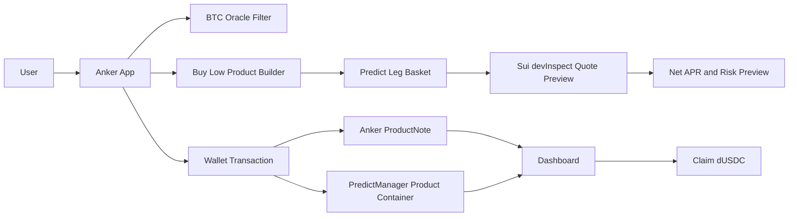

# Anker Protocol

**Self-custody Dual Investment on Sui, powered by DeepBook Predict.**

Anker Protocol is an on-chain alternative to Binance-style Dual Investment. It
starts with **BTC Buy Low**: a product crypto users already understand, rebuilt
with wallet custody, transparent DeepBook Predict legs, live quote previews,
on-chain ProductNotes, and a dashboard claim flow.

The goal is not to create another prediction-market interface. The goal is to
take a proven structured-product category, remove the black box, and make the
pricing, risk, and settlement path visible before the user commits.

## The Product Thesis

Dual Investment already has product-market fit. Centralized exchanges package
it as a simple user promise:

> Choose a target BTC price and a settlement date. Earn a reward while waiting
> for BTC to reach that target.

That framing works because it is concrete. A user does not need to understand
volatility surfaces, binary options, or multi-leg strategies. They understand:

- I have USDC.
- I would like to buy BTC lower.
- I am willing to take defined settlement risk.
- I want to know the reward before I subscribe.

The problem is that CEX Dual Investment is opaque:

- The user gives up custody.
- The quote, spread, and risk premium are controlled by the exchange.
- The user cannot inspect how the APR is built.
- Settlement is an account entry, not a composable on-chain position.
- The product cannot be reused by other DeFi protocols.

Anker keeps the familiar user journey, but moves the product construction onto
Sui. DeepBook Predict supplies the live oracle, expiry, strike grid, volatility
pricing, and settlement primitives. Anker turns those primitives into a product
that feels like Dual Investment, while showing the exact legs and costs behind
the quote.

## Why Users Would Care

The APR is important, but it is not the only edge.

Anker does **not** claim to beat Binance for every target, expiry, or market
condition. The edge is market-dependent. When DeepBook Predict pricing and
liquidity are favorable, Anker can surface a higher **net APR after protocol
fee** than a matched CEX Dual Investment quote. When that edge is not present,
the product should show that honestly rather than inventing yield.

What Anker offers in every market condition:

- **Self-custody**: users keep wallet control and sign their own transactions.
- **Transparent pricing**: every Predict leg, strike, payout quantity, and ask
  cost is visible.
- **Comparable APR**: Anker displays net APR after protocol fee, not a gross
  headline number.
- **Benchmark-aware discovery**: the Price & APR reference table compares
  Anker's net APR with matched Binance Dual Investment rows and shows the edge
  in percentage points when a match exists.
- **On-chain evidence**: ProductNote objects and transaction links make the
  product lifecycle inspectable.
- **Clear risk**: the app shows payout scenarios, minimum payout, maximum loss,
  quote TTL, liquidity status, and settlement limitations.
- **Future composability**: the product note path can evolve into tokenized
  strategy shares, vaults, and integrations across Sui DeFi.

## Anker vs. CEX Dual Investment

| Question | Binance-style Dual Investment | Anker Protocol |
| --- | --- | --- |
| Who holds the funds? | CEX account | User wallet and wallet-owned product container |
| How is APR produced? | Exchange quote | DeepBook Predict leg basket, priced with live quote previews |
| Can the user inspect the legs? | No | Yes: strikes, payouts, ask costs, and payoff scenarios |
| Is APR shown net of protocol fee? | Exchange-defined | Yes, Anker shows net APR after its fee snapshot |
| How is CEX comparison shown? | Native CEX quote only | Price & APR reference table with `Est. APR`, `Binance APR`, and `Edge` |
| Can the product be verified? | Off-chain account records | Sui ProductNote, PredictManager state, events, and explorer links |
| Can another protocol compose with it? | No | Roadmap to tokenized notes and vault shares |
| Is the APR always better? | Not applicable | No guarantee; edge depends on live market pricing |

The founder-level wedge is simple:

```text
Binance proved users want Dual Investment.
Anker makes it self-custodial, transparent, and on-chain.
DeepBook Predict makes the quote and settlement possible.
```

## First Product: BTC Buy Low

Anker V1 is a dUSDC-denominated **BTC Buy Low Dual Investment** product.

User inputs:

- **Amount**: subscription size in dUSDC.
- **Buy Low price**: the target BTC price, below current spot.
- **Settlement date**: selected from live-ready DeepBook Predict oracle
  expiries.
- **Payoff smoothness**: an advanced setting that controls whether the Predict
  ladder uses 3, 6, or 9 UP legs.

The floor price is not a user input. Anker derives it from the Buy Low price,
aligns it to the live oracle strike grid, and uses it to size the cash reserve.

The main discovery surface is the **Price & APR reference** table. It lists
Buy Low target prices below spot and shows:

- **Est. APR**: Anker's net APR after protocol fee.
- **Binance APR**: the closest matched Binance Dual Investment benchmark when
  available.
- **Edge**: Anker net APR minus Binance APR, displayed in percentage points.

Rows without a valid Binance match show `--` rather than forcing a comparison.
Tapping a target price loads it into the Buy Low builder, and the Refresh button
updates the live quote and benchmark state.

User outcomes:

- If BTC stays above the target region, the user keeps dUSDC plus the coupon.
- If BTC settles into the buy-low region, the product produces the
  cash-settled payoff for the intended buy-low exposure.
- On current testnet, the product claims dUSDC rather than delivering BTC,
  because a clean dUSDC-to-DBTC delivery route is not available yet. The UI
  makes this explicit instead of pretending the production delivery path exists.

This is not a risk-free savings account. It is a structured product with defined
payoff behavior. Anker's job is to show the user the quote, the construction,
the risk, and the settlement path before they subscribe.

## How The Quote Is Built

Anker compiles a BTC Buy Low subscription into a strip of DeepBook Predict UP
legs.

For a product with:

- principal `P`
- target Buy Low price `T`
- auto-derived floor price `F`
- target BTC amount `Q = P / T`

Anker:

1. Reserves cash for the floor: `reserve = Q * F`.
2. Builds a ladder of Predict UP legs from `F` to `T`.
3. Aligns every strike to the live oracle grid.
4. Sizes each leg's dUSDC payout quantity as `Q * width`, where `width` is that
   leg's strike interval.
5. Uses live DeepBook Predict quote previews to price every leg.
6. Computes coupon and net APR after protocol fee.

```text
total leg cost = sum of live ask costs
coupon         = principal - reserve - total leg cost
gross_APR      = coupon / principal * 365 / days_to_expiry
net_APR        = gross_APR * (1 - protocol_fee_bps / 10000)
```

`net_APR` is the number shown across the product: reference table, preview,
confirmation panel, and dashboard. The dashboard computes each note's reward
APR from the fee snapshot stored in that ProductNote, not from a mutable current
setting.

Each UP leg pays dUSDC if BTC settles above its strike. Together, the ladder
reconstructs the payoff that a centralized exchange would normally hide behind
a single APR number.

## APR Benchmarking

Anker includes a Binance Dual Investment benchmark layer so users can compare
the product against the CEX category they already know.

In the live app this appears directly in the **Price & APR reference** table:

```text
Buy Low | Est. APR | Binance APR | Edge
```

`Edge` is a percentage-point difference, not an absolute return guarantee:

```text
Edge = Anker net APR after fee - matched Binance APR
```

The benchmark is intentionally conservative:

- Match the same product direction: BTC Buy Low.
- Match Binance's **BTCUSDC Dual Investment** product, not Binance BTCUSDT rows.
- Match target price and settlement date to the nearest available CEX row.
- Compare Anker **net APR after protocol fee** against the matched CEX APR.
- Show `--` when no benchmark row is available instead of implying an edge.
- Exclude stale, non-executable, or unquoted Anker legs from subscription.
- Treat the edge as market-dependent, not guaranteed.

The point is not "Anker always pays more." The point is that Anker can show
when the edge exists, explain where the quote comes from, and still be useful
when the APR is only competitive because self-custody and transparency are part
of the product value.

## User Flow

```text
1. Open Anker.
2. Choose BTC Buy Low.
3. Use the Price & APR reference table to compare target prices, Anker net APR,
   matched Binance APR, and Edge.
4. Tap a target price to load it into the Buy Low builder.
5. Enter or adjust dUSDC amount and settlement date.
6. Review payoff scenarios, quote freshness, liquidity, and risk fields.
7. Expand the leg details to inspect every DeepBook Predict position.
8. Create a wallet-owned product container if needed.
9. Subscribe with a wallet transaction.
10. Receive a ProductNote that records the product terms.
11. Track the note in the dashboard.
12. Claim dUSDC after expiry.
```

The product is designed so a normal user can stay at the Dual Investment layer,
while an advanced user can inspect the underlying Predict construction.

## What Is Live

The current repo includes:

- Next.js app with landing page, Dual Investment workspace, and dashboard.
- Live-ready BTC oracle discovery through a narrow Predict API wrapper.
- Product compiler from Buy Low terms to Predict leg baskets.
- DeepBook Predict quote preview path through Sui `devInspect`.
- Price & APR reference table with `Buy Low`, `Est. APR`, `Binance APR`, and
  `Edge` columns.
- Binance Dual Investment benchmark fetch and nearest-row matching logic.
- Quote freshness, liquidity, slippage, and executable-status checks.
- Wallet flow for creating a dedicated PredictManager product container.
- ProductNote Move package deployed on Sui testnet.
- Event-indexed ProductNote dashboard with settlement and claim states.
- Guardrails that prevent preview-only paths, unsafe note construction, and
  misleading principal-plus-coupon shortcuts from entering live code paths.

## DeepBook Predict Integration

Anker uses DeepBook Predict in four places.

### 1. Oracle Discovery

A Next.js API wrapper filters BTC oracles to markets that are ready for the
product:

- active oracle
- valid expiry
- spot and forward available
- SVI state available
- enough time remaining before expiry

The product selector uses these live-ready expiries rather than free-form dates.

### 2. Product Construction

The product compiler maps the user's Buy Low terms into Predict UP leg intents.
It aligns strike choices to the oracle grid and derives the floor/reserve path
from the selected target.

### 3. Quote Preview

The app batches quote preview calls through Sui `devInspect`. Each leg receives:

- strike
- direction
- payout quantity
- ask cost
- executable status
- quote timestamp
- error state when unavailable

The preview also surfaces:

- minimum payout
- maximum loss
- option budget
- holding-period return
- net APR after fee
- quote validity TTL
- liquidity status
- max-cost slippage limit

### 4. Execution And Claim

Users first create a wallet-owned product container, currently a dedicated
DeepBook PredictManager. Subscription uses an unallocated product container,
deposits principal, prepares Predict mint calls, and creates an Anker
ProductNote that records the product terms and container relationship.

Signing is gated by a short-lived `QuoteEnvelope`:

- exact-leg re-quote at signing time
- max quoted cost bounds
- minimum accepted coupon floor
- transaction preflight

The dashboard reads ProductNote events and PredictManager state to show:

- owned notes
- active and completed products
- product container dUSDC balance
- held Predict legs
- backing ratio
- settlement-blocked states when backing is incomplete
- claim actions after expiry

Claim can redeem open Predict legs before withdrawing dUSDC, or withdraw
directly if those legs were already redeemed permissionlessly.

## On-chain Contract

The Move package lives in:

```text
contracts/anker_protocol
```

Current testnet deployment:

```text
Network:      Sui testnet
Package ID:   0xf8fc120ddb43b29bab88fb42588f94db9d1af34164969d2d76400f068c5a7640
Registry ID:  0xf9d64b058a640f05a7f2c7ec3e289399c41124900f9e6dc73840cf96df7bb63c
AdminCap ID:  0xdb8b99921a44c216c5c864ddec9df21bfb4a09cc0d97287e4940e6be615c2478
Digest:       BoKKnVdeKccDh9C1W1huPsvBDmojH3qLMR3CMKnfkhHU
```

The contract provides:

- `Registry` for protocol fee policy.
- `AdminCap` for fee policy administration.
- `ProductNote` as a wallet-owned record of structured product subscriptions.
- Full economic term storage: principal, reserve, coupon, target/floor price,
  APR, fee bps, expiry, strikes, quantities, costs, and redeemed payout.
- Product lifecycle events: `FeePolicyUpdated`, `ProductSubscribed`,
  `ProductRedeemed`.
- Fee capture on claim through `record_redeem_with_fee`.

The current testnet contract is deliberately scoped. It records product terms,
fee policy, lifecycle status, and the user's PredictManager relationship as a
wallet-owned strategy receipt while leaving Predict position custody with the
user's PredictManager.

It is not yet a fully trustless pooled vault. That is a deliberate product
choice. DeepBook Predict's current manager model is still evolving, so Anker V1
keeps custody wallet-native and makes the current settlement model explicit.

Because DeepBook Predict mint does not currently expose an atomic max-cost
parameter in this app, Anker relies on quote TTLs, signing-time re-quotes, and
transaction preflight rather than claiming full on-chain price protection.

## Architecture



Primary directories:

```text
app/                         Next.js App Router pages and API routes
src/components/              Landing page, Dual Investment page, Dashboard, supporting UI
src/products/                Product math, payoff simulation, strike grid, fee policy, quote envelope
src/application/             Subscribe and settle orchestration
src/deepbook/                DeepBook Predict and Binance benchmark clients
src/sui/                     Sui transaction builders, preflight, portfolio/event parsers
src/hooks/                   React Query hooks for markets, quotes, benchmark, ProductNote events
src/server/                  Server-side oracle filtering and API response helpers
src/config/                  Network, contract, runtime-mode, feature-flag config
src/current/                 Current.finance USDsui APR benchmark client
contracts/anker_protocol/    Move ProductNote contract
scripts/                     Lint guardrails and contract/CI contract tests
tests/                       Playwright end-to-end tests
docs/                        Design specs and plans
```

## Routes

```text
/                         Landing page
/app                      Dual Investment workspace
/app/dual-investment      BTC Buy Low Dual Investment
/app/dashboard            Wallet ProductNote dashboard
/dual-investment          Legacy redirect -> /app/dual-investment
```

## Demo Narrative

For a short judge or investor demo:

1. Start with the product category: Binance already proved Dual Investment
   demand.
2. Show the user problem: custody, black-box pricing, and off-chain settlement.
3. Open Anker and select BTC Buy Low.
4. Show the Price & APR reference table: `Est. APR`, matched `Binance APR`, and
   `Edge` in percentage points.
5. Point out that rows with no benchmark match show `--`, not a forced claim.
6. Tap a target price to load the Buy Low builder.
7. Open the leg disclosure and show every Predict strike, payout, and ask cost.
8. Explain that the headline APR is net of protocol fee and can lose its edge
   when market pricing changes.
9. Create or select a wallet-owned product container.
10. Subscribe and show the ProductNote.
11. Open the dashboard and show position state, backing, explorer links, and
   claim flow.
12. Close with the roadmap: Sell High, range yield, auto-roll series, and
    tokenized notes.

The message should stay product-first:

```text
Users do not buy "a strategy compiler."
Users buy a familiar structured product with better custody, transparency,
and sometimes a better live quote.
```

## Risks And Scope

Anker is explicit about the current limitations:

- Dual Investment has downside settlement risk and is not guaranteed yield.
- APR advantage is market-dependent and can disappear.
- Live quotes can expire before signing.
- Some Predict legs can become non-executable because of liquidity or mint
  bounds.
- Current testnet flow is dUSDC cash-settled, not BTC-delivered.
- ProductNotes are wallet-owned strategy receipts today, not transferable vault
  shares.
- The current implementation uses a dedicated wallet-owned PredictManager
  rather than pooled custody.

These constraints are shown because they matter. A product that exposes risk is
more credible than one that hides it behind a higher APR headline.

## Roadmap

### 1. Better Benchmarking

The first benchmark screen is live in the Price & APR reference table. The next
iteration should make matching quality and decision context even clearer:

- show target discount and settlement-date matching quality
- separate "benchmark unavailable" from "no edge"
- show holding-period return next to annualized APR
- expose liquidity and quote freshness beside each benchmark row
- add historical snapshots so users can see how often an edge appears

This turns APR comparison into a decision tool, not a marketing claim.

### 2. Sell High And Product Shelf

The next product is BTC Sell High: BTC collateral in, stablecoin proceeds out
when the target is reached. From there, Anker can add:

- Discount Buy and Premium Sell notes
- principal-protected range yield
- capped upside and downside participation notes
- auto-roll structured yield series
- institutional quote screens across targets and expiries

### 3. Production BTC Delivery

V1 is cash-settled in dUSDC. Production should add one of:

- native BTC-settled Predict support
- DeepBook DBTC/dUSDC conversion with slippage limits
- collateralized Target Sale / Sell High once DBTC collateral and settlement
  routing are clean

### 4. Tokenized Notes And Vault Shares

Tokenized shares become the right abstraction once product container ownership
and production settlement stabilize. That unlocks:

- pooled strategy series
- auto-roll keepers
- management and performance fees
- vault share composability across Sui DeFi
- integrations with lending, margin, and portfolio protocols

### 5. Distribution

The long-term distribution thesis is not to make users learn DeepBook Predict.
It is to meet users where they already are:

- CEX-style structured yield buyers
- DeFi users looking for self-custody yield products
- BTC holders who want target buy / target sell strategies
- protocols that want transparent structured note inventory

DeepBook Predict is the pricing and settlement substrate. Anker is the product
layer that can bring that substrate to users who already understand structured
yield.

## Running Locally

```bash
npm install
npm run dev
```

The app runs on:

```text
http://127.0.0.1:3000
```

Environment variables are optional overrides. Values fall back to committed
testnet defaults in `src/config/*` and
`contracts/anker_protocol/deployments/testnet.json`.

```text
NEXT_PUBLIC_SUI_NETWORK=testnet
NEXT_PUBLIC_DEEPBOOK_PREDICT_PACKAGE_ID=0xf5ea2b3749c65d6e56507cc35388719aadb28f9cab873696a2f8687f5c785138
NEXT_PUBLIC_DEEPBOOK_PREDICT_OBJECT_ID=0xc8736204d12f0a7277c86388a68bf8a194b0a14c5538ad13f22cbd8e2a38028a
NEXT_PUBLIC_ANKER_PACKAGE_ID=0xf8fc120ddb43b29bab88fb42588f94db9d1af34164969d2d76400f068c5a7640
NEXT_PUBLIC_ANKER_REGISTRY_ID=0xf9d64b058a640f05a7f2c7ec3e289399c41124900f9e6dc73840cf96df7bb63c
NEXT_PUBLIC_ANKER_ADMIN_CAP_ID=0xdb8b99921a44c216c5c864ddec9df21bfb4a09cc0d97287e4940e6be615c2478

ANKER_DETERMINISTIC_E2E=true
DEMO_ALLOW_UNSIMULATED_TX=true
ENABLE_EXPERIMENTAL_PRODUCTS=true
```

The `/api/predict/[...path]` wrapper is intentionally narrow. It only proxies
the Predict endpoints used by the app, uses an 8s upstream timeout, caps
responses at 1 MB, adds cache headers, and applies a basic per-client rate
limit before fetching upstream.

## Verification

```bash
npm run ci
```

`npm run ci` runs:

```text
npm run lint
npm run test:unit
npm run test:move
npm run build
npm run test:e2e
```

Individual checks:

```bash
npm run lint
npm run test:unit
npm run test:move
npm run build
npm run test:e2e
```

`npm run lint` includes Anker-specific guardrails that scan frontend, contract,
test, script, and README paths. The guardrails prevent misleading or unsafe
patterns such as first-manager selection, public ProductNote constructors,
transferable ProductNotes, principal-plus-coupon settlement shortcuts,
preview-only execution in live paths, live Shark Fin frontend paths, and unsafe
number-to-bigint conversion.

## References

- Source: https://github.com/cl-fi/AnkerProtocol
- Binance Dual Investment product category: https://www.binance.com/en/dual-investment
- DeepBook Predict problem statement: `DeepBook Predict Problem Statement.md`
- DeepBook Predict docs: https://docs.sui.io/onchain-finance/deepbook-predict/
- DeepBook Predict testnet server: https://predict-server.testnet.mystenlabs.com
