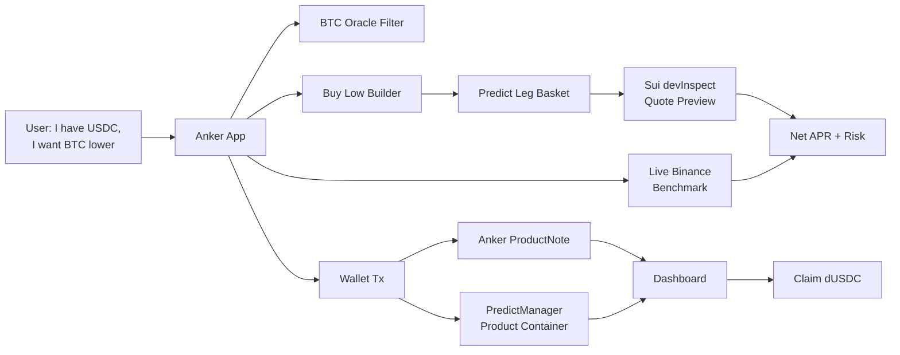

# Anker Protocol

**The Dual Investment product crypto users already love — rebuilt self-custody on Sui, with a live Binance price check built into the screen.**

> I have USDC. I want to buy BTC lower. Tell me exactly what I earn for waiting, show me how you got that number, and let me keep custody of my money.

That sentence is the whole product. It's also one of the most popular structured-yield products on any centralized exchange: on Binance, Dual Investment lets users pick a target BTC price below spot, pick a date, and earn a coupon while they wait. The play is familiar and the category is large and proven — Anker doesn't have to invent demand, it has to rebuild a product people already use, without the parts they shouldn't have to accept.

Anker keeps that familiar promise and fixes the part users don't see: on a CEX you hand over custody, you can't inspect how the APR is built, and the position lives as an account entry the exchange controls. Anker rebuilds the same product on Sui using **DeepBook Predict**, so the funds stay in your wallet, the quote is constructed from transparent on-chain legs, and — the part that makes the value undeniable — **the discovery screen shows Anker's net APR next to the live Binance APR for the same trade, side by side.**

Live on Sui testnet. First product: **BTC Buy Low**, denominated in dUSDC.

---

## The user's job, and where today's product fails them

The reason Dual Investment works on CEXs is that the pitch is concrete. A user doesn't need to understand volatility surfaces or binary options. They understand four things:

- I have USDC.
- I'd like to buy BTC lower than it is now.
- I'm willing to take defined settlement risk.
- I want to know the reward **before** I commit.

CEX Dual Investment answers the last point with a single APR number — and then asks the user to trust it. The problems are all the things behind that number:

- **Custody is gone.** Your funds sit in an exchange account, not your wallet.
- **The quote is a black box.** Spread, risk premium, and how the APR is built are the exchange's to set and yours to accept.
- **The position isn't composable.** It's an account entry, not an on-chain object other protocols can read or build on.
- **There's no proof.** You can't independently verify what you're holding or what it settles to.

Anker keeps the exact same user journey — pick a price, pick a date, see the reward — and moves the construction on-chain so none of that is hidden.

---

## The wedge: a live Binance check, right on the screen

Most "we're better than the CEX" claims are an assertion in a pitch deck. Anker turns it into a column in the product.

The main discovery surface is the **Price & APR reference** table:

```text
Buy Low (target price) | Est. APR | Binance APR | Edge
```

- **Est. APR** — Anker's **net APR after the 10% protocol fee** (the real, take-home number).
- **Binance APR** — the matched **live** Binance Dual Investment row, pulled from Binance's public earn API.
- **Edge** — Anker net APR minus Binance APR, in percentage points.

The Binance feed is fetched live, filtered to **BTCUSDC + projectType=DOWN** (= Buy Low), sorted by APY, and polled roughly every 10s. A row is matched only when the rounded strike equals the target **and** the settlement date lines up (exact time preferred).

In testnet observation, when a Binance match exists, Anker's net APR usually runs **~10–20 percentage points higher** than the matched Binance row — and there are structural reasons for that, not luck (see the next section). But it stays **honest by design**: Anker does **not** always win, the edge moves with live DeepBook Predict pricing and liquidity, and when there's no valid match the table shows `--` rather than inventing a comparison. A user who watches the edge appear and disappear in real time trusts the number when it's there.

The felt benefit isn't "we're cheaper." It's: **you don't have to take our word for it, and you keep custody either way.**

---

## Why the edge is structural, not luck

A bigger number only matters if there's a reason it should hold. Anker's edge comes from **where the yield is sourced and how little is skimmed before it reaches the user** — not from taking on more risk.

Underneath, Dual Investment yield is an **option premium**: the user is paid to commit to buying BTC lower. The only real question is how much of that premium the user keeps. On a centralized exchange, structurally, the answer is "less than it could be":

- **It's priced by a market, not a counterparty.** On a CEX the exchange *is* your counterparty and sets the coupon, keeping an opaque spread between the true premium and what it pays out. Anker sources the same premium from DeepBook Predict — a live, on-chain options market — and builds the payoff at market quotes. You buy near wholesale instead of the exchange's retail markup.
- **Composability lets Anker build the exact payoff from cheap primitives.** Because Predict legs are composable, Anker assembles the precise Buy Low ladder from the best-priced legs and passes the real cost through, instead of reselling a pre-packaged product at a markup. You get the construction, not the bundle — and that opportunity only exists because DeepBook Predict exposes the legs in the first place.
- **One small, explicit fee.** A CEX's take is spread + risk premium + implicit fees, baked invisibly into the quote. Anker charges a single disclosed **10% performance fee, and only on coupon actually earned** — materially less than a CEX's hidden cut. Less off the top, more net APR.
- **Incentives point the right way.** A CEX earns more by paying you *less*. Anker earns a fixed share of the coupon, so it earns more only when *you* earn more. The business model itself pushes APR up, not down.
- **Transparency caps the spread.** Every leg, cost, and the fee are on screen, with the live Binance number right beside Anker's. That public comparison is a structural ceiling on how much margin anyone in the stack can quietly take — you'd watch it move.
- **No custody or settlement rent.** No exchange desk, off-chain accounting, or counterparty-risk premium to fund. On-chain settlement keeps that overhead out of the quote.

That's why, in testnet observation, the edge typically lands at **~10–20 percentage points** when a match exists — not as a one-off, but because the structure is built to route more of the premium to the user. It's still market-dependent — wider when DeepBook Predict pricing and liquidity are favorable, tighter when they aren't — and the screen shows it honestly either way. The claim isn't "Anker always wins." It's "Anker is built so the user keeps more of the yield, and you can verify it live."

---

## Anker vs. CEX Dual Investment

| The user's question | Binance-style Dual Investment | Anker Protocol |
| --- | --- | --- |
| Who holds my money? | The exchange | Your wallet + a wallet-owned product container |
| How was this APR produced? | Exchange quote, take it or leave it | A basket of DeepBook Predict legs, priced with live quote previews |
| Can I see the legs behind the number? | No | Yes — every strike, payout quantity, and ask cost |
| Is the APR shown net of fees? | Exchange-defined | Yes — net APR after Anker's fee snapshot |
| Can I compare it to the CEX I know? | No | Yes — live `Est. APR / Binance APR / Edge` on the same screen |
| Can I prove what I hold? | Off-chain account record | On-chain `ProductNote` + events + explorer links |
| Can another protocol build on it? | No | Roadmap to tokenized notes and vault shares |
| Is it always a better deal? | N/A | No — edge is market-dependent and shown honestly |

```text
Binance proved users want Dual Investment.
Anker makes it self-custodial, transparent, and on-chain —
and proves the value with a live side-by-side instead of a slogan.
```

---

## The product: BTC Buy Low

Anker V1 is a dUSDC-denominated **BTC Buy Low Dual Investment**.

**What the user enters:**

- **Amount** — subscription size in dUSDC.
- **Buy Low price** — the target BTC price, below current spot.
- **Settlement date** — chosen from live-ready DeepBook Predict oracle expiries.
- **Payoff smoothness** *(advanced)* — a 3 / 6 / 9 Predict-leg preset (default 6) controlling ladder granularity.

The **floor price is not a user input.** Anker derives it from the Buy Low price, snaps it to the live oracle strike grid, and uses it to size the cash reserve. Less for the user to get wrong.

**The journey, end to end:**

```text
1.  Open Anker, choose BTC Buy Low.
2.  Scan the Price & APR reference table — compare targets, Anker net APR,
    live Binance APR, and Edge in percentage points.
3.  Tap a target price to load it into the Buy Low builder.
4.  Set the dUSDC amount and settlement date.
5.  Review payoff scenarios, quote freshness, liquidity, and risk fields.
6.  Expand the legs to inspect every DeepBook Predict position.
7.  Create a wallet-owned product container (one tx) if you don't have one.
8.  Subscribe with a wallet transaction.
9.  Receive a ProductNote that records every term of the trade.
10. Track it in the dashboard.
11. Claim dUSDC after expiry.
```

A normal user can stay entirely at the Dual Investment layer. An advanced user can open the leg disclosure and audit the exact construction.

**What the user gets at settlement:**

- If BTC stays above the target region, they keep their dUSDC **plus the coupon**.
- If BTC settles into the buy-low region, they get the cash-settled payoff for the intended buy-low exposure.
- On current testnet this **claims dUSDC rather than delivering BTC** — there's no clean dUSDC→DBTC route yet, and the UI says so explicitly instead of pretending the production delivery path exists.

This is a structured product with defined payoff behavior, not a risk-free savings account. Anker's job is to show the quote, the construction, the risk, and the settlement path **before** the user commits.

---

## How the quote is built

Every reward number in the app is compiled from real DeepBook Predict legs — never a guess. For a product with principal `P`, target Buy Low price `T`, and auto-derived floor `F`:

1. Target BTC amount: `Q = P / T`.
2. Reserve cash for the floor: `reserve = Q * F`.
3. Build a ladder of Predict **UP** legs from `F` to `T`, every strike aligned to the live oracle grid.
4. Size each leg's dUSDC payout quantity as `Q * width`, where `width` is that leg's strike interval.
5. Price every leg with a **live DeepBook Predict quote preview** through Sui `devInspect`.
6. Compute the coupon and the net APR after fee.

```text
total leg cost = sum of live ask costs
coupon         = principal - reserve - total leg cost
gross_APR      = coupon / principal * 365 / days_to_expiry
net_APR        = gross_APR * (1 - protocol_fee_bps / 10000)
```

`net_APR` is the number shown everywhere: reference table, preview, confirmation panel, and dashboard. The dashboard computes each note's reward from the **fee snapshot stored in that ProductNote**, not a mutable current setting.

The quote model is layered for honesty:

- An **instant local Estimate** for fast browsing.
- Upgraded to a **verified Live quote** (badge) priced against the chain.
- **Subscription is only enabled on a matched, executable live quote.** Legs that can't be live-quoted fall back to a clearly-marked, non-executable snapshot — never a fake APR.

---

## The business model — real revenue, surfaced honestly

Anker charges a **performance fee — a protocol fee on the coupon, default 1000 bps = 10%.** It only ever applies to coupon actually earned, and it's exactly the gap between the gross APR and the net APR the user sees — so the user is never surprised, and the headline number is always the take-home number. For context, that single transparent cut is materially smaller than the combined, invisible margin a CEX bakes into its Dual Investment quote.

- The fee lives in the on-chain **Registry** (`Registry.fee_bps`), administrable via `AdminCap`.
- It's captured at claim time through `record_redeem_with_fee`, which routes the fee to the registry's fee recipient.
- Each `ProductNote` stores its **own `fee_bps` snapshot**, so the dashboard computes each position's reward from the fee that applied at subscription.

The incentive alignment is the pitch: **Anker only earns when it actually sources a coupon for the user.** No coupon, no fee. Revenue scales directly with delivered value, and it's enforced on-chain rather than promised.

---

## Who buys this, and why now

**Who:**

- CEX-style structured-yield buyers who want the same product without giving up custody.
- BTC holders running target-buy / target-sell strategies.
- DeFi users looking for transparent, self-custody yield.
- Protocols that want auditable structured-note inventory to build on.

**Why now:** DeepBook Predict newly exposes on-chain BTC oracles, rolling expiries, strike grids, and volatility-based digital-option pricing **and settlement**. For the first time it's possible to construct a CEX-grade structured product entirely on-chain, with live quotes. The primitives exist; what's missing is the product and distribution layer that turns them into something a normal user understands. **That layer is Anker.**

---

## What's live today

This isn't a mockup — the full path works end to end on Sui testnet.

- **Next.js app**: landing page, Dual Investment workspace, dashboard.
- **Live BTC oracle discovery** via a narrow Predict API wrapper (8s timeout, 1 MB cap, cache headers, per-client rate limit; only proxies the endpoints the app uses).
- **Product compiler**: Buy Low → Predict legs, with live `devInspect` quote previews and full risk fields (min payout, max loss, option budget, holding-period return, quote TTL, liquidity status, max-cost slippage).
- **Live Binance benchmark** with `Est. APR / Binance APR / Edge` columns.
- **Wallet flow**: create a PredictManager container → subscribe → mint a ProductNote.
- **Event-indexed dashboard** with claim + settlement states and Sui explorer links.
- **ProductNote Move package deployed on Sui testnet.**
- **7 static lint guardrails** across frontend / contract / tests / scripts / README, plus CI: `lint → unit → move test → next build → playwright e2e` (fail-fast).

---

## The Sui / DeepBook Predict integration

Anker uses DeepBook Predict in four places, and leans on Sui's primitives for custody and proof.

### 1. Oracle discovery
A Next.js API wrapper filters BTC oracles to product-ready markets: active oracle, valid expiry, spot and forward available, SVI state available, enough time remaining. The settlement-date picker uses these **live-ready expiries**, not free-form dates.

### 2. Product construction
The compiler maps the user's Buy Low terms into Predict UP leg intents, aligns strikes to the oracle grid, and derives the floor/reserve path from the selected target.

### 3. Quote preview
Quote previews are batched through Sui `devInspect`. Each leg returns strike, direction, payout quantity, ask cost, executable status, quote timestamp, and an error state when unavailable. The preview also surfaces min payout, max loss, option budget, holding-period return, net APR after fee, quote TTL, liquidity status, and the max-cost slippage limit.

### 4. Execution, custody, and on-chain proof

**Self-custody by construction.** The user first creates a wallet-owned **product container** — a dedicated DeepBook `PredictManager` (via `create_manager`, a separate wallet tx). Subscribe uses an unallocated, wallet-owned container, deposits principal, mints the Predict legs, and creates an Anker `ProductNote` bound to that container. It **fails closed** if no container exists — never silently grabs someone else's.

**A real signing gate.** Subscription is fronted by a short-lived `QuoteEnvelope` (30s TTL) with a signing-time re-quote of the exact legs, max-quoted-cost bounds, a minimum-accepted-coupon floor, and transaction preflight. (DeepBook Predict mint has no atomic max-cost parameter in this app, so Anker uses TTL + re-quote + preflight rather than overclaiming full on-chain price protection.)

**The ProductNote is the proof.** It's a Move object owned by the user's wallet that records principal, reserve, coupon, target/floor price, `apr_bps`, `fee_bps`, expiry, strikes, quantities, costs, status, and redeemed payout/fee. It is a wallet-owned **strategy receipt** — honestly, not yet a transferable or pooled vault share.

**The dashboard reads the chain.** It's event-indexed (paginating ProductNote Move events by type, indexed by note / owner / manager) into lifecycle buckets — Ready to claim / Active / Completed — with a portfolio summary (Total deposited / Expected rewards / Open positions), product-container dUSDC balance and held legs, backing ratio, a **settlement-blocked safety state on partial backing**, and Sui explorer (`testnet.suivision.xyz`) links for every object and transaction. Claim redeems open legs before withdrawing dUSDC, or withdraws directly if the legs were already redeemed permissionlessly.



---

## Honest risks and scope

A product that shows its risk is more credible than one that hides it behind a higher APR headline. The app states all of this explicitly:

- **Settlement risk is real.** Dual Investment has downside settlement risk; this is not guaranteed yield.
- **The edge can disappear.** The APR advantage is market-dependent and moves with live DeepBook Predict pricing.
- **Quotes can expire** before signing, and some legs can become non-executable on liquidity or mint bounds.
- **Testnet is cash-settled.** The flow claims dUSDC, **not** delivered BTC — there's no clean dUSDC→DBTC route yet, and the UI says so.
- **ProductNotes are receipts, not shares.** They're wallet-owned today, not transferable or pooled vault shares; custody is a dedicated wallet-owned PredictManager, not pooled custody.
- A Current.finance USDsui APR benchmark exists in code but is **behind a flag** (`ENABLE_EXPERIMENTAL_PRODUCTS`) and **not live in the UI** today.

---

## Roadmap

**1. Sharper benchmarking.** Build on the live Binance check: show target-discount and settlement-date matching quality, separate "benchmark unavailable" from "no edge," put holding-period return beside annualized APR, expose liquidity and freshness per row, and add historical snapshots so users can see how often an edge appears. Turn comparison into a decision tool.

**2. Sell High and a product shelf.** Next product is **BTC Sell High** (BTC collateral in, stablecoin out at the target). Then Discount Buy / Premium Sell notes, principal-protected range yield, capped participation notes, auto-roll series, and institutional quote screens across targets and expiries.

**3. Production BTC delivery.** V1 is cash-settled in dUSDC. Production adds native BTC-settled Predict support and/or DeepBook DBTC↔dUSDC conversion with slippage limits, unlocking collateralized Sell High once settlement routing is clean.

**4. Tokenized notes and vault shares.** Once container ownership and production settlement stabilize, ProductNotes become tokenized strategy shares — pooled series, auto-roll keepers, management/performance fees, and composability with Sui lending, margin, and portfolio protocols.

**5. Distribution.** The thesis isn't to make users learn DeepBook Predict — it's to meet them where they are: CEX-style yield buyers, self-custody DeFi users, BTC target-buy/sell holders, and protocols that want transparent structured-note inventory. DeepBook Predict is the substrate; **Anker is the product layer.**

---

## Appendix

### On-chain contract (Sui testnet)

The Move package lives in `contracts/anker_protocol`.

```text
Network:      Sui testnet
Package ID:   0xf8fc120ddb43b29bab88fb42588f94db9d1af34164969d2d76400f068c5a7640
Registry ID:  0xf9d64b058a640f05a7f2c7ec3e289399c41124900f9e6dc73840cf96df7bb63c
AdminCap ID:  0xdb8b99921a44c216c5c864ddec9df21bfb4a09cc0d97287e4940e6be615c2478
Digest:       BoKKnVdeKccDh9C1W1huPsvBDmojH3qLMR3CMKnfkhHU
```

The contract provides the `Registry` (fee policy, default 10%), `AdminCap`, `ProductNote`, the events `FeePolicyUpdated` / `ProductSubscribed` / `ProductRedeemed`, and fee capture on claim. Two product kinds exist (Dual Investment = 0, Shark Fin = 1); **Shark Fin is contract-only** and blocked from live frontend paths by lint guardrails.

The testnet contract is deliberately scoped: it records product terms, fee policy, lifecycle status, and the PredictManager relationship as a wallet-owned strategy receipt, while leaving Predict position custody with the user's PredictManager. It is not yet a trustless pooled vault — a deliberate choice while DeepBook Predict's manager model evolves.

### Routes

```text
/                      Landing page
/app                   Alias → same workspace page
/app/dual-investment   BTC Buy Low Dual Investment
/app/dashboard         Wallet ProductNote dashboard
/dual-investment       Legacy redirect → /app/dual-investment
```

### Run locally

```bash
npm install
npm run dev
# → http://127.0.0.1:3000
```

Environment variables are optional overrides — values fall back to committed testnet defaults in `src/config/*` and `contracts/anker_protocol/deployments/testnet.json`.

```text
NEXT_PUBLIC_SUI_NETWORK=testnet
NEXT_PUBLIC_DEEPBOOK_PREDICT_PACKAGE_ID=0xf5ea2b3749c65d6e56507cc35388719aadb28f9cab873696a2f8687f5c785138
NEXT_PUBLIC_DEEPBOOK_PREDICT_OBJECT_ID=0xc8736204d12f0a7277c86388a68bf8a194b0a14c5538ad13f22cbd8e2a38028a
NEXT_PUBLIC_ANKER_PACKAGE_ID=0xf8fc120ddb43b29bab88fb42588f94db9d1af34164969d2d76400f068c5a7640
NEXT_PUBLIC_ANKER_REGISTRY_ID=0xf9d64b058a640f05a7f2c7ec3e289399c41124900f9e6dc73840cf96df7bb63c
NEXT_PUBLIC_ANKER_ADMIN_CAP_ID=0xdb8b99921a44c216c5c864ddec9df21bfb4a09cc0d97287e4940e6be615c2478
```

The `/api/predict/[...path]` wrapper is intentionally narrow: it only proxies the Predict endpoints the app uses, with an 8s upstream timeout, a 1 MB response cap, cache headers, and a basic per-client rate limit.

### Verify

```bash
npm run ci
```

`npm run ci` runs `lint → test:unit → test:move → build → test:e2e` (fail-fast). `npm run lint` includes Anker-specific guardrails that block misleading or unsafe patterns: first-manager selection, public `ProductNote` constructors, transferable `ProductNote`s, principal-plus-coupon settlement shortcuts, preview-only execution in live paths, live Shark Fin frontend paths, and unsafe number-to-bigint conversion.

### References

- Source: https://github.com/cl-fi/AnkerProtocol
- Binance Dual Investment category: https://www.binance.com/en/dual-investment
- DeepBook Predict docs: https://docs.sui.io/onchain-finance/deepbook-predict/
- DeepBook Predict testnet server: https://predict-server.testnet.mystenlabs.com
