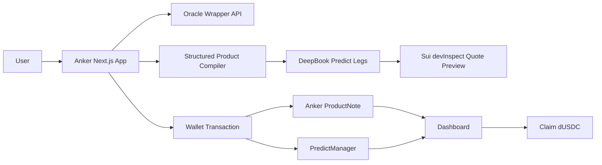

# Anker Protocol

**Drop anchor on your yield.**

Structured yield products, built on DeepBook's prediction markets.

Anker Protocol turns DeepBook Predict into a user-facing structured yield layer. The first product is **BTC Buy Low Dual Investment**: a familiar CEX-style product rebuilt on Sui with transparent legs, live on-chain quote previews, wallet-owned product notes, and a clear claim flow.

## Vision

DeepBook Predict is more than a prediction market UI. It is a programmable volatility and digital-option pricing layer: live BTC oracles, rolling expiries, strike grids, and vol-surface-based quotes are exposed as composable on-chain primitives.

Anker's long-term vision is to become the **structured product compiler for DeepBook Predict**.

Instead of asking users to manually trade raw UP, DOWN, or range legs, Anker packages those legs into products that already exist in investor mental models:

- Buy Low / Sell High Dual Investment
- Discount Buy and Premium Sell notes
- principal-protected range yield
- capped upside and downside participation notes
- auto-roll structured yield series
- future tokenized vault shares that other Sui DeFi protocols can compose with

The first demo focuses on BTC Buy Low because it is the clearest wedge: it is already proven by CEX demand, easy for users to understand, and directly demonstrates that DeepBook Predict can power real structured yield products rather than isolated binary bets.

## Why This Matters

Crypto users already buy structured products. Dual Investment is one of the most proven examples across centralized exchanges. On Binance, the product category is called **Dual Investment**, with user-facing directions named **Buy Low** and **Sell High**. Users choose terms such as **Target Price** and **Settlement Date**, then receive rewards based on whether the target is reached at settlement.

The problem is that CEX Dual Investment is still a black box:

- Users cannot inspect how the yield is sourced.
- The quote, spread, and risk premium are controlled by the exchange.
- Product inventory is not composable with DeFi.
- Settlement and accounting happen off-chain.

Anker brings the same product mental model on-chain. Instead of asking users to trade raw binary options, Anker compiles familiar structured products into DeepBook Predict legs and shows the exact cost, coupon, APR, payoff, and settlement path.

## Product

### BTC Buy Low Dual Investment

The V1 product is a dUSDC-denominated BTC Buy Low product.

User inputs:

- Subscription amount
- Target Price
- Floor Price
- Settlement Date
- Payoff smoothness, expressed as the number of Predict UP legs

User-facing outcome:

- If BTC stays above the target region, the user keeps dUSDC plus coupon.
- If BTC settles into the buy-low region, the product produces the cash-settled payoff needed for the intended BTC buy path.
- On current testnet, the dashboard is honest about settlement: the product claims dUSDC because a clean dUSDC-to-DBTC delivery route is not available yet.

The important product choice is intentional: Anker does not pretend to deliver BTC on testnet when the route is not available. It shows a cash-settled structured payoff today and leaves BTC delivery for the production path.

### Why start here

Buy Low is the right first product because it is both familiar and technically revealing.

- Familiar: CEX users already understand the goal: earn yield while waiting to buy BTC at a lower target price.
- Useful: The product has a real trading use case, not just speculative entertainment.
- Transparent: Anker can show where the APR comes from by exposing every Predict leg.
- Expandable: Once the compiler works for Buy Low, the same approach extends to Sell High, range notes, protected notes, and auto-roll strategies.

## How It Works

Anker compiles the Buy Low product into a strip of DeepBook Predict binary UP legs.

For a product with:

- principal `P`
- target price `T`
- floor price `F`
- target BTC amount `Q = P / T`

the compiler:

1. Reserves cash for the floor: `reserve = Q * F`
2. Builds a ladder of Predict UP legs from `F` to `T`
3. Uses real DeepBook Predict quote previews to price every leg
4. Computes coupon from remaining capital:

```text
coupon = principal - reserve - total Predict leg cost
APR = coupon / principal * 365 / days_to_expiry
```

Each UP leg pays dUSDC if BTC settles above its strike. Combined together, the strip reconstructs the structured payoff that a CEX would normally hide behind a single APR number.

This is the product compiler pattern:

```text
User product intent
  -> payoff shape
  -> Predict leg basket
  -> live quote preview
  -> executable wallet transaction
  -> ProductNote and dashboard claim
```

Buy Low is one concrete payoff shape. The protocol layer is designed so future payoff shapes can reuse the same pipeline.

## What Makes It Different

### 1. Familiar product, transparent construction

Users see a product they already understand: Dual Investment Buy Low. Advanced users can inspect the underlying Predict legs, strikes, quantities, ask costs, and payoff chart.

### 2. Real quotes, not heuristic simulation

The scan board and custom preview use DeepBook Predict live preview logic through Sui `devInspect`. Rows that cannot be quoted are marked unavailable instead of showing fake APRs.

### 3. CEX-grade flow with DeFi-grade auditability

The product keeps the CEX mental model:

- subscription amount
- target price
- settlement date
- coupon / APR
- claim after expiry

but replaces opaque exchange pricing with on-chain, inspectable Predict positions.

### 4. Wallet-owned product notes

Every subscription can create an Anker `ProductNote` object on Sui. The note records the product parameters, Predict manager, oracle, strikes, quantities, costs, fee policy, and redemption status.

### 5. Honest testnet scope

The DeepBook Predict manager model is still evolving. Instead of forcing a pooled vault share too early, V1 uses wallet-native notes and a dashboard that reflects the actual PredictManager state. This keeps the demo functional today while preserving a clean path toward tokenized vault shares later.

## DeepBook Predict Integration

Anker integrates DeepBook Predict in four places:

1. **Oracle discovery**
   - A Next.js API wrapper filters BTC oracles to show live-ready markets only.
   - Expiries with missing quote data are removed from the product selector.

2. **Leg construction**
   - The product compiler maps Buy Low parameters into Predict UP leg intents.
   - Strike grids are aligned to the live oracle's valid market grid.

3. **Quote preview**
   - The app batches Predict quote preview calls through Sui `devInspect`.
   - Each leg gets a real ask cost and executable status.

4. **Execution and claim path**
   - Users can create a PredictManager.
   - Subscribe flow prepares Predict mint calls and creates an Anker ProductNote.
   - Dashboard checks PredictManager balances and positions.
   - Claim can redeem open Predict legs before withdrawing dUSDC, or withdraw directly if the legs were already redeemed permissionlessly.

## On-chain Contract

The Move package lives in:

```text
contracts/anker_protocol
```

Current testnet deployment:

```text
Network:     Sui testnet
Package ID:  0xf8fc120ddb43b29bab88fb42588f94db9d1af34164969d2d76400f068c5a7640
Registry ID: 0xf9d64b058a640f05a7f2c7ec3e289399c41124900f9e6dc73840cf96df7bb63c
Digest:      BoKKnVdeKccDh9C1W1huPsvBDmojH3qLMR3CMKnfkhHU
```

The contract provides:

- `Registry` for protocol fee policy
- `ProductNote` as a wallet-owned record of structured product subscriptions
- `ProductSubscribed` event
- `ProductRedeemed` event
- fee capture on claim

The V1 contract is deliberately lightweight. It records the product and fee layer while leaving Predict position custody with the user's PredictManager until DeepBook Predict's production position model stabilizes.

## App Flow



## Demo Flow

For a five-minute hackathon demo, the recommended flow is:

1. Open the landing page and frame the product:
   - "CEX Dual Investment, rebuilt transparently on DeepBook Predict."
2. Launch the app and show BTC Buy Low scan board:
   - live BTC oracle
   - real expiry selector
   - target prices below spot only
   - live quote status
3. Open a custom preview:
   - subscription amount
   - Target Price
   - Floor Price
   - smoothness / leg count
4. Show the payoff chart and Predict leg disclosure:
   - strikes
   - dUSDC payout quantities
   - ask costs
   - coupon and APR
5. Subscribe with a wallet:
   - create PredictManager if needed
   - mint Predict legs
   - create ProductNote
6. Open Dashboard:
   - show owned ProductNotes
   - show PredictManager dUSDC balance and held legs
   - claim dUSDC after expiry

The story is product-first: users do not need to understand binary options to use Anker, but the option construction is fully visible when they want to inspect it.

## Project Structure

```text
app/                         Next.js App Router pages and API routes
src/components/              Landing page, Dual Investment page, Dashboard
src/products/                Product math, payoff simulation, strike grid logic
src/deepbook/                DeepBook Predict server and quote provider clients
src/sui/                     Sui transaction builders and portfolio parsers
src/server/                  Server-side oracle filtering and API response helpers
contracts/anker_protocol/    Move ProductNote contract
tests/                       Playwright end-to-end tests
```

## Routes

```text
/                         Landing page
/app                      Dual Investment workspace
/app/dual-investment      BTC Buy Low Dual Investment
/app/dashboard            Wallet ProductNote dashboard
```

## Running Locally

```bash
npm install
npm run dev
```

The app runs on:

```text
http://127.0.0.1:3000
```

Useful environment variables:

```text
NEXT_PUBLIC_SUI_NETWORK=testnet
NEXT_PUBLIC_DEEPBOOK_PREDICT_PACKAGE_ID=0xf5ea2b3749c65d6e56507cc35388719aadb28f9cab873696a2f8687f5c785138
NEXT_PUBLIC_DEEPBOOK_PREDICT_OBJECT_ID=0xc8736204d12f0a7277c86388a68bf8a194b0a14c5538ad13f22cbd8e2a38028a
NEXT_PUBLIC_ANKER_PACKAGE_ID=0xf8fc120ddb43b29bab88fb42588f94db9d1af34164969d2d76400f068c5a7640
NEXT_PUBLIC_ANKER_REGISTRY_ID=0xf9d64b058a640f05a7f2c7ec3e289399c41124900f9e6dc73840cf96df7bb63c
```

## Verification

```bash
npm run lint
npm test
npm run build
npm run test:e2e
```

Move tests:

```bash
cd contracts/anker_protocol
sui move test
```

## Roadmap

### Structured product compiler

The core roadmap is not "add more pages." It is to turn Anker into a reusable compiler from user-friendly product terms to executable DeepBook Predict portfolios:

```text
Product template
  + user parameters
  + live oracle / SVI quote surface
  + risk bounds
  -> Predict leg basket
  -> quote, payoff, APR, and execution plan
```

This lets Anker ship new products without rebuilding the whole system each time. The product layer becomes a distribution and UX surface for DeepBook Predict's volatility quotes.

### Production BTC delivery

V1 is cash-settled in dUSDC because the current testnet path does not provide a clean dUSDC-to-DBTC delivery route. The production version should add one of:

- native BTC-settled Predict support
- a DeepBook DBTC/dUSDC conversion path with slippage limits
- a collateralized Target Sale / Sell High flow once DBTC collateral and settlement routing are clean

### Tokenized vault shares

Tokenized vault shares are intentionally not forced into V1. They become the right abstraction when PredictManager position ownership and production settlement flows stabilize. At that point Anker can support:

- pooled strategy series
- auto-roll keepers
- management and performance fees
- vault share composability across Sui DeFi

### Product expansion

The same compiler model can support a broader product shelf:

- **Sell High Dual Investment**
  - BTC collateral in, stablecoin proceeds out when the target is reached.
- **Discount Buy / Premium Sell**
  - more advanced Dual Investment variants with knock-out zones or partial conversion.
- **Principal-protected range yield**
  - base yield plus option-funded range participation.
- **Capped participation notes**
  - directional upside or downside exposure with a defined max return.
- **Auto-roll strategy series**
  - repeated Buy Low or Sell High cycles with user-selected risk preferences.
- **Institutional quote screens**
  - compare product APR, leg cost, and payoff across expiries and strikes.

## Why Anker Fits the DeepBook Track

DeepBook Predict is a powerful primitive, but raw binary markets are not how most users think about structured yield. DeepBook provides the volatility quote and settlement substrate; Anker turns that substrate into products people already know how to buy.

That makes Anker valuable to both sides of the ecosystem:

- **For users**
  - familiar structured products
  - transparent APR and payoff construction
  - wallet-owned positions and claim flow
- **For DeepBook Predict**
  - a concrete distribution layer for vol-surface-priced markets
  - repeatable demand for rolling expiries and strike ladders
  - product-level use cases beyond raw prediction bets
- **For Sui DeFi**
  - structured notes that can later become vault shares
  - composable yield products built from auditable on-chain legs
  - a path toward margin, lending, and keeper integrations

The result is not just a technical demo. It is the first product in a larger thesis: DeepBook Predict can become Sui's on-chain volatility layer, and Anker can be the structured product layer that brings that volatility to real users.

## References

- Binance Dual Investment naming and product terms: https://www.binance.com/en/dual-investment
- DeepBook Predict problem statement: `DeepBook Predict Problem Statement.md`
- DeepBook Predict docs: https://docs.sui.io/onchain-finance/deepbook-predict/
- DeepBook Predict testnet server: https://predict-server.testnet.mystenlabs.com
