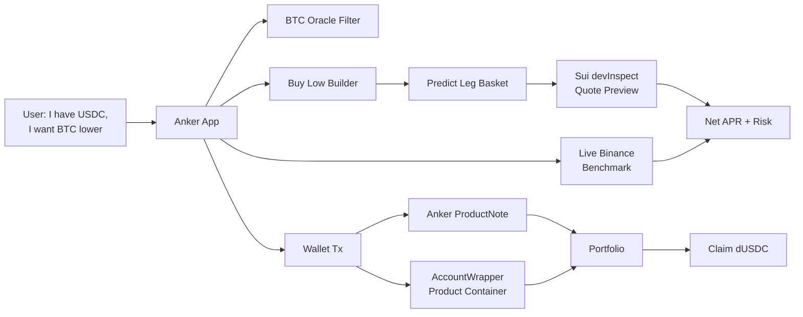

# Anker Protocol

**Self-custody Dual Investment on Sui, benchmarked live against Binance. Powered by DeepBook Predict.**

**Live app: [ankerprotocol.xyz](https://www.ankerprotocol.xyz)** · [Analytics](https://www.ankerprotocol.xyz/analytics) · [Demo video](https://www.youtube.com/watch?v=byzsvdkuAjk) · [X @ankerprotocol](https://x.com/ankerprotocol)

Sign in with Google (Enoki zkLogin) — no wallet extension, no seed phrase, gas sponsored: **users never need to hold SUI**.


Anker rebuilds Dual Investment — the structured-yield staple offered by every
major CEX — as a self-custodial Sui product:
users can take a BTC Buy Low position with dUSDC, see the reward before
committing, compare the quote against Binance, and inspect the exact DeepBook
Predict legs behind the APR.

> I have USDC. I want to buy BTC lower. Show me the reward, the risk, and the
> construction before I commit.

**Live aggregate benchmark:** the Benchmark Recorder compares Anker's net APR
against the matching Binance product every 15 minutes. Over 10,899 matched
samples (July 14–17, 2026): ahead of Binance **98.2% of the time**, median
edge **+6.10 APR points**. Live results and full methodology on the
[Analytics page](https://www.ankerprotocol.xyz/analytics) — testnet pricing
observations, not a promised return.

Live on Sui testnet. First product: **BTC Buy Low**, denominated in dUSDC.

---

## Why users earn more

Every major CEX — Binance, OKX, Bybit, Matrixport among them — sells Dual
Investment, and extracts value from it in three layers. Anker returns all
three to the user:

| Value layer | On a CEX | On Anker |
| --- | --- | --- |
| **The option premium** | Opaque spread; the exchange keeps the margin | Market-priced by DeepBook Predict, one explicit 10% fee — ahead of Binance in 98.2% of 10,899 live matched samples |
| **The float on idle principal** | The exchange keeps the interest | Earns in `deepbook_margin` / `iron_bank`, routed back into the coupon *(roadmap)* |
| **The position itself** | Frozen in an exchange account until settlement | Tokenized vault share, portable collateral across Sui DeFi *(roadmap)* |

The first layer is live today and continuously measured; the next two are the
[roadmap](#roadmap) — capital efficiency a CEX structurally cannot match. That
does not mean Anker wins every row; it means the product has a durable reason
to price better.

And the trust layer comes free: funds stay in a product container only the
user's wallet can authorize, every subscription mints a wallet-owned
`ProductNote` as on-chain proof, and the only protocol take is an explicit
performance fee on coupon actually earned.

---

## The product: BTC Buy Low

Anker V1 is a dUSDC-denominated **BTC Buy Low Dual Investment**.

**What the user enters:**

- **Amount** — subscription size in dUSDC.
- **Buy Low price** — the target BTC price, below current spot.
- **Settlement date** — chosen from live-ready DeepBook Predict expiry markets.
- **Payoff smoothness** *(advanced)* — a 3 / 6 / 9 Predict-leg preset (default 6) controlling ladder granularity.

The **floor price is not a user input.** Anker derives it from the Buy Low price, snaps it to the live oracle strike grid, and uses it to size the cash reserve. Less for the user to get wrong.

**The journey, end to end:**

```text
1.  Open Anker, choose BTC Buy Low.
2.  Scan the Price & APR reference table — compare targets, Anker net APR,
    live Binance APR, and Edge in percentage points.
3.  Tap a target price to load it into the Buy Low builder.
4.  Set the dUSDC amount and settlement date.
5.  Review payoff scenarios, quote freshness, liquidity, and risk fields.
6.  Expand the legs to inspect every DeepBook Predict position.
7.  Create a wallet-owned product container (one tx, gas-sponsored for
    Google-login sessions) if you don't have one.
8.  Subscribe with a wallet transaction (also gas-sponsored).
9.  Receive a ProductNote that records every term of the trade.
10. Track it in the portfolio.
11. Claim dUSDC after expiry.
```

A normal user can stay entirely at the Dual Investment layer. An advanced user can open the leg disclosure and audit the exact construction.

**What the user gets at settlement:**

- If BTC stays above the target region, they keep their dUSDC **plus the coupon**.
- If BTC settles into the buy-low region, they get the cash-settled payoff for the intended buy-low exposure.
- On current testnet this **claims dUSDC rather than delivering BTC** — there's no clean dUSDC→DBTC route yet, and the UI says so explicitly instead of pretending the production delivery path exists.

This is a structured product with defined payoff behavior, not a risk-free savings account.

---

## How the quote is built

Every reward number in the app is compiled from real DeepBook Predict legs — never a guess. For a product with principal `P`, target Buy Low price `T`, and auto-derived floor `F`:

1. Target BTC amount: `Q = P / T`.
2. Reserve cash for the floor: `reserve = Q * F`.
3. Build a ladder of Predict **UP** legs from `F` to `T`, every strike aligned to the live oracle grid.
4. Size each leg's dUSDC payout quantity as `Q * width`, where `width` is that leg's strike interval.
5. Price every leg with a **live DeepBook Predict quote preview** through Sui `devInspect`.
6. Compute the coupon and the net APR after fee.

```text
total leg cost = sum of live ask costs
coupon         = principal - reserve - total leg cost
gross_APR      = coupon / principal * 365 / days_to_expiry
net_APR        = gross_APR * (1 - protocol_fee_bps / 10000)
```

`net_APR` is the number shown everywhere: reference table, preview, confirmation panel, and portfolio. The portfolio computes each note's reward from the **fee snapshot stored in that ProductNote**, not a mutable current setting.

The quote model is layered for honesty:

- An **instant local Estimate** for fast browsing.
- Upgraded to a **verified Live quote** (inline status flag) priced against the chain.
- **Subscription is only enabled on a matched, executable live quote.** Legs that can't be live-quoted fall back to a clearly-marked, non-executable snapshot — never a fake APR.

---

## The business model

Anker charges a **performance fee on the coupon — default 1000 bps = 10%** —
never on principal. It is exactly the gap between the gross APR and the net APR
the user sees, so the headline number is always the take-home number. The
target user is the CEX structured-yield buyer who wants the same product
without giving up custody.

- The fee lives in the on-chain **Registry** (`Registry.fee_bps`), administrable via `AdminCap`.
- It's captured at claim time through `record_redeem_with_fee`, which routes the fee to the registry's fee recipient.
- Each `ProductNote` stores its **own `fee_bps` snapshot**, so the portfolio computes each position's reward from the fee that applied at subscription.

**No coupon, no fee** — Anker earns only when the user earns, enforced on-chain.

---

## What's live today

This isn't a mockup — the full path works end to end on Sui testnet.

- **Next.js app**: Dual Investment workspace, portfolio, analytics.
- **Live BTC expiry-market discovery** via a narrow Predict API wrapper (8s timeout, 1 MB cap, cache headers, per-client rate limit; only proxies the endpoints the app uses).
- **Product compiler**: Buy Low → Predict legs, with live `devInspect` quote previews and full risk fields.
- **Live Binance benchmark and aggregate Analytics** — `Est. APR / Binance APR / Edge` on the product ladder, plus the 15-minute Benchmark Recorder feeding the Analytics page.
- **Wallet flow**: create an AccountWrapper container → subscribe → mint a ProductNote.
- **Enoki zkLogin + sponsored gas**: Google sign-in with no wallet extension; container setup, subscribe, claim, and send all execute gas-sponsored, so a CEX user can complete the whole lifecycle without ever holding SUI.
- **Event-indexed portfolio** with claim + settlement states and Sui explorer links.
- **ProductNote Move package deployed on Sui testnet.**
- **8 static lint guardrails** across frontend / contract / tests / scripts / README, plus CI: `lint → unit → move test → next build → playwright e2e` (fail-fast).

---

## The Sui / DeepBook Predict integration

DeepBook Predict newly puts the primitives a structured product needs on-chain
— BTC oracle feeds, rolling expiries, strike grids, and volatility-priced
digital options with on-chain settlement. Anker uses them in four places, and
leans on Sui's object model for custody and proof.

### 1. Market discovery
A Next.js API wrapper filters BTC expiry markets to product-ready ones: active oracle feed, valid expiry, spot and forward available, SVI state available, enough time remaining. The settlement-date picker uses these **live-ready expiries**, not free-form dates.

### 2. Product construction
The compiler maps the user's Buy Low terms into Predict UP leg intents, aligns strikes to the oracle grid, and derives the floor/reserve path from the selected target.

### 3. Quote preview
Quote previews are batched through Sui `devInspect`. Each leg returns strike, direction, payout quantity, ask cost, executable status, quote timestamp, and an error state when unavailable. The preview also surfaces min payout, max loss, option budget, holding-period return, net APR after fee, quote TTL, liquidity status, and the max-cost slippage limit.

### 4. Execution, custody, and on-chain proof

**Self-custody by construction.** The user first creates a dedicated **product container** — a DeepBook `AccountWrapper` (via `account_registry::new` + `account::share`, a separate wallet tx) that only the owner's wallet can authorize. Subscribe uses an unallocated container bound to the connected wallet, deposits principal, mints the Predict legs, and creates an Anker `ProductNote` bound to that container. It **fails closed** if no container exists — never silently grabs someone else's.

**A real signing gate.** Subscription is fronted by a short-lived `QuoteEnvelope` (30s TTL) with a signing-time re-quote of the exact legs, max-quoted-cost bounds, a minimum-accepted-coupon floor, and transaction preflight. (DeepBook Predict mint has no atomic max-cost parameter in this app, so Anker uses TTL + re-quote + preflight rather than overclaiming full on-chain price protection.)

**The ProductNote is the proof.** It's a Move object owned by the user's wallet that records principal, reserve, coupon, target/floor price, `apr_bps`, `fee_bps`, expiry, strikes, quantities, costs, status, and redeemed payout/fee. It is a wallet-owned **strategy receipt** — honestly, not yet a transferable or pooled vault share.

**The portfolio reads the chain.** It's event-indexed (paginating ProductNote Move events by type, indexed by note / owner / wrapper) into lifecycle buckets — Ready to claim / Active / Completed — with a portfolio summary (Available / In position / Total assets / Expected rewards / Cumulative rewards), product-container dUSDC balance and held legs, backing ratio, a **settlement-blocked safety state on partial backing**, and Sui explorer (`testnet.suivision.xyz`) links for every object and transaction. Claim redeems open legs before withdrawing dUSDC, or withdraws directly if the legs were already redeemed permissionlessly.



---

## Honest risks and scope

A product that shows its risk is more credible than one that hides it behind a higher APR headline. The app states all of this explicitly:

- **Settlement risk is real.** Dual Investment has downside settlement risk; this is not guaranteed yield.
- **APR is live, not promised.** The benchmark table shows current matched quotes and updates as DeepBook Predict and Binance pricing move.
- **Quotes can expire** before signing, and some legs can become non-executable on liquidity or mint bounds.
- **Testnet is cash-settled.** The flow claims dUSDC, **not** delivered BTC — there's no clean dUSDC→DBTC route yet, and the UI says so.
- **ProductNotes are receipts, not shares.** They're wallet-owned today, not transferable or pooled vault shares; custody is a dedicated per-user AccountWrapper, not pooled custody.

---

## Roadmap

Three steps: complete the product, tokenize it, then compose it — delivering
the float and collateral layers above, and capital efficiency a CEX
structurally cannot match.

**1. BTC Sell High — complete the Dual Investment pair.** Buy Low is live;
Sell High (BTC collateral in, stablecoin out at the target) completes the
product every CEX user expects, and opens the shelf for range and capped notes.

**2. Tokenized vault shares with auto-roll.** ProductNotes grow into pooled,
tokenized strategy shares: deposits auto-deploy at each expiry, positions
auto-roll on settlement, and a withdrawal queue handles exits — while
redemption rights stay with the share holder.

**3. Capital efficiency: compose with lending.** Two loops on top of the vault
share. Idle floor reserve earns inside money markets (`deepbook_margin` supply,
`iron_bank`) for the life of a position, with the interest routed back into the
user's coupon. And the vault share itself becomes portable collateral across
Sui lending and margin — so a position can back a loan instead of sitting
frozen. A CEX keeps the float and freezes the position; Anker returns one and
unlocks the other.

**Mainnet day one.** When DeepBook Predict reaches mainnet, Anker redeploys on
day one — and the Benchmark Recorder restarts on the first block, turning the
testnet evidence base into a mainnet track record.

---

## Appendix

### On-chain contract (Sui testnet)

The Move package lives in `contracts/anker_protocol`.

```text
Network:          Sui testnet
Package ID:       0x81c22159defb84b45965a54883196f9f21670b14c2f410e4b0b20d25e3fe14cc
Original package: 0x281ef5e11fb96556602388e4d1db56b8b888518b5fe5f9aef69d4842228df1a9
Registry ID:      0x5d495080d06c1ef3663b1f20654d497b40d0829732714e9d36facc9c11dfab5c
AdminCap ID:      0xea1f89284ae01bfc22633fe3e7ce55bbef9638028dee7706b2c8d1c6ed743cdb
Publish digest:   4AbKGfmvTuBP98XPnC9ZqkzCc74ri4XEtgyGGgxvhrPm
Upgrade digest:   DeCtmu7SyWbsudT5Xb7Y5TmpThNzQWZehxAcw6QWoXzT
```

The canonical source for these IDs is
[`contracts/anker_protocol/deployments/testnet.json`](contracts/anker_protocol/deployments/testnet.json),
which the app reads directly — the block above is a convenience copy.

The contract provides the `Registry` (fee policy, default 10%), `AdminCap`, `ProductNote`, the events `FeePolicyUpdated` / `ProductSubscribed` / `ProductRedeemed`, and fee capture on claim. Two product kinds exist (Dual Investment = 0, Shark Fin = 1); **Shark Fin is contract-only** and blocked from live frontend paths by lint guardrails.

The testnet contract is deliberately scoped: it records product terms, fee policy, lifecycle status, and the AccountWrapper relationship as a wallet-owned strategy receipt, while leaving Predict position custody with the user's AccountWrapper. It is not yet a trustless pooled vault — a deliberate choice while DeepBook Predict's manager model evolves.

### Routes

```text
/                      Redirect → /app/dual-investment (the product is the landing)
/app                   Alias → same workspace page
/app/dual-investment   BTC Buy Low Dual Investment (hourly + day tenors)
/app/portfolio         Wallet ProductNote portfolio
/analytics             Aggregate Anker vs Binance benchmark analytics
/app/dashboard         Legacy redirect → /app/portfolio
/app/multi-day         Legacy redirect → /app/dual-investment (merged page)
/dual-investment       Legacy redirect → /app/dual-investment
```

### Run locally

```bash
npm install
npm run dev
# → http://127.0.0.1:3000
```

Environment variables are optional overrides — see [`.env.example`](.env.example). Unset values fall back to committed testnet defaults in `src/config/*` and `contracts/anker_protocol/deployments/testnet.json` (package IDs, Predict wiring). DeepBook Predict package/object IDs come from the vendored deployment JSON, not from env.

**Vercel:** set `NEXT_PUBLIC_SITE_URL=https://www.ankerprotocol.xyz` on Production and Preview so Open Graph / canonical URLs are not baked as localhost. Leave RPC, Predict, and Anker package overrides unset unless you intentionally need them — empty Vercel env is otherwise fine for the current testnet product. All `NEXT_PUBLIC_*` vars are build-time: change them, then Redeploy.

```text
# Required on Vercel Production + Preview
NEXT_PUBLIC_SITE_URL=https://www.ankerprotocol.xyz

# Optional — defaults shown; prefer deployments/testnet.json for Anker IDs
NEXT_PUBLIC_SUI_NETWORK=testnet
NEXT_PUBLIC_ANKER_DEMO_MODE=false
```

`NEXT_PUBLIC_ANKER_DEMO_MODE=true` puts the app in demo-data mode: market data, quotes, and the container list are served from deterministic fixtures, a demo banner is shown on every app page, and every transaction entry point is disabled (the transaction builders also refuse to build plans as a backstop). Use it only when the DeepBook Predict testnet deployment the app targets is entirely unavailable — day tenors already degrade to the committed Snapshot on their own (ADR-0004), so this switch is for outages the Snapshot can't cover. It's a build-time flag: redeploy after changing it. Never enable `ANKER_DETERMINISTIC_E2E` on Production.

The `/api/predict/[...path]` wrapper is intentionally narrow: it only proxies the Predict endpoints the app uses, with an 8s upstream timeout, a 1 MB response cap, cache headers, and a basic per-client rate limit.

### Verify

```bash
npm run ci
```

`npm run ci` runs `lint → test:unit → test:move → build → test:e2e` (fail-fast). `npm run lint` includes Anker-specific guardrails that block misleading or unsafe patterns: first-container selection, public `ProductNote` constructors, transferable `ProductNote`s, principal-plus-coupon settlement shortcuts, preview-only execution in live paths, live Shark Fin frontend paths, unsafe number-to-bigint conversion, and localhost fallbacks for the public site URL.

### References

- Live app: https://www.ankerprotocol.xyz
- Analytics: https://www.ankerprotocol.xyz/analytics
- X: https://x.com/ankerprotocol
- Demo video: https://www.youtube.com/watch?v=byzsvdkuAjk
- Source: https://github.com/cl-fi/AnkerProtocol
- Binance Dual Investment category: https://www.binance.com/en/dual-investment
- DeepBook Predict docs: https://docs.sui.io/onchain-finance/deepbook-predict/
- DeepBook Predict testnet server: https://predict-server.testnet.mystenlabs.com
